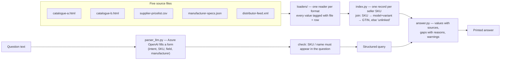

# Answers

Throughout, "the client" is my command-line tool, and file names refer to the five files in
`fixtures/data-engineering-v3/`. Row numbers are the ones the client prints (e.g. "supplier-pricelist.csv, line 3").

---

## Q1 — Architecture

**In plain words:** the tool works in two separate halves. The first half reads all five files and
builds one page per product, where every value is labelled with the file and row it came from. The
second half understands the question (with the help of an AI model), then looks the answer up on those
pages. The AI model only reads the question; it never sees or writes product data.



**Parts:** `loaders/` (one small reader per file), `index.py` (joins them without guessing),
`parser_llm.py` (question → structured query; `parser_rules.py` is a keyword alternative), `answer.py`
(formats the answer), `__main__.py` (the `--task` command, error messages).

**A sixth file (second price list, other format):** I would **add** one file, `loaders/pricelist_b.py`
(a short reader that maps its columns to my field names), and **add one line** to the list in
`loaders/__init__.py`. I would **not touch** `index.py`, the parsers, `answer.py` or `__main__.py`. I tested
exactly this: `tests/test_second_pricelist.py` adds an invented second price list for SYN-142-21T. The
tool then shows both prices side by side, each with its own supplier and valid-from date ("not stated"
for today's file), instead of merging them or picking one.

Honest limits: this only works if the new file uses the seller SKU. If it used, say, a manufacturer
article number, `index.py` would need a new linking rule. And prices in different units (per piece vs
per box) are shown, not converted.

---

## Q2 — Communication

Below is what my tool prints for product SYN-261-38X, and then the same answer as a short message to a buying colleague. The key point: our files only name this product; its price, maker, pack size and barcode are in none of them . Exact output for `--task "get the information on seller sku SYN-261-38X"` (also in `transcript.md`):

```text
Understood as: all information on seller SKU SYN-261-38X   [parsed by Azure OpenAI gpt-4.1-mini]

Seller SKU SYN-261-38X
Found in 1 of 5 files: catalogue-b.html (table row 24)
Not in: catalogue-a.html, supplier-pricelist.csv, manufacturer-specs.json, distributor-feed.xml

WHAT THE CORPUS SAYS
  Product model         NimbusCare 261   [catalogue-b.html, table row 24]
  Variant               38 X   [catalogue-b.html, table row 24]
  Catalogue code        261 XR/38 X   [catalogue-b.html, table row 24]
  Description           Fictional wound-care training pad, lot 2023, shelf F6   [catalogue-b.html, table row 24]

WHAT THE CORPUS DOES NOT SAY
  Manufacturer          NOT IN CORPUS - no row for this SKU in supplier-pricelist.csv, manufacturer-specs.json (no record with this model + variant)
  Price                 NOT IN CORPUS - no row for this SKU in supplier-pricelist.csv
  GTIN                  NOT IN CORPUS - no row for this SKU in manufacturer-specs.json (no record with this model + variant), distributor-feed.xml
  PZN                   NOT IN CORPUS - no row for this SKU in distributor-feed.xml
  Packaging             NOT IN CORPUS - no row for this SKU in distributor-feed.xml
  Technical specs       NOT IN CORPUS - no row for this SKU in supplier-pricelist.csv or manufacturer-specs.json (no record with this model + variant)

NOTES
  - The model name starts with "NimbusCare". That is a brand name, not a stated manufacturer, so no manufacturer is inferred from it.
```

**Message to a procurement colleague:**

> Hi, about article SYN-261-38X: we can't make an order decision from our data yet.
> All we have is one seller's catalogue entry: it's a "NimbusCare 261" wound-care training pad, size 38 X.
> We have **no price, no manufacturer, no pack size, no barcode (GTIN/PZN) and no technical details** for it.
> This isn't something our tool failed to find: none of the five supplier files contains this product except
> that one catalogue line. The catalogue entry also mentions "lot 2023, shelf F6", which looks like a
> warehouse note; I can't tell whether it means the item is in stock.
> One thing I deliberately did *not* do: another product line in the price list is made by "NimbusCare
> Supplies BV", so it's tempting to assume they make this one too — but no file says so.
> To decide, we'd need a price and pack size from the seller, and the manufacturer confirmed.

**Why the gaps exist:** every gap here is *missing from the corpus entirely*. My client reports two
different kinds of gap. "NOT IN CORPUS" means no file has a row for this product. "EMPTY IN SOURCE"
means a file has the row, but the cell is blank (for example the connector of SYN-352-21T in
supplier-pricelist.csv, line 8). For SYN-261-38X nothing exists that the client cannot reach.

---

## Q3 — Quality assurance

**In plain words:** I check that the program does what I meant (automated tests), that the supplier
files themselves are sound (they are not always), and that a printed number is safe to act on.

**Software testing.** 32 automated tests run in two seconds, without internet (`python -m pytest`).
The most useful, `test_every_value_is_found_in_the_row_it_cites` (`tests/test_never_invent.py`), takes
every value the tool knows about all 123 products (663 values) and looks it up in exactly the file row
the tool names as its source. An invented value, or two products mixed up while combining files, makes
it fail. Other tests cover the five tasks, empty cells, unknown SKUs, and that only the question reaches
the AI model. Not tested: the real model on many phrasings.

**Data quality (one real problem).** A barcode's (GTIN's) last digit is a built-in typo check. For
SYN-100-15S, `04012345000011` (distributor-feed.xml item 1, manufacturer-specs.json record 1) fails it:
the last digit should be 6, not 1. **All six GTINs** in the corpus fail. The tool prints the GTIN as
written and warns it is unverified; it does not "correct" it, as that would be a number no source contains.

**Trust — "is 9.80 EUR for SYN-142-21T right?"** I would check:
1. **the right row:** supplier-pricelist.csv line 3, exact SKU match (printed with the answer);
2. **per what?** distributor-feed.xml item 2 sells it as a box of 12; the price list has no unit;
3. **from whom, how current?** the price list names no supplier and no date (the tool says so);
4. **a second opinion:** only one file has prices.

My honest answer: "correctly copied, not yet safe to order on."

---

## Q4 — Scalability

**In plain words:** today the tool re-reads every file for every question. That is instant for 130
rows; with 5 million it would take minutes and more memory than a laptop has. The fix: read the files
once each night into a database, and make each question a quick lookup.

**What breaks first, in my code:**
1. `Corpus.load()` in `index.py` reads all files on **every** question: minutes per answer.
2. Memory: every cell becomes a separate object in memory, about 75 million of them, tens of GB.
3. `_link_without_sku()` compares **every** spec record with **every** product. With millions on both
   sides, that is trillions of comparisons: it would not finish overnight.
4. The AI model alone needs roughly 0.5–1.5 seconds per question.

**What I would change, in this order:**
1. **Read at night, answer by day.** A nightly job loads all files into a database (PostgreSQL). The
   database keeps an *index* on SKU, GTIN and manufacturer, like the index at the back of a book: it
   jumps straight to the right page instead of reading every page. Answers take milliseconds.
2. **Link records in that nightly job**, not per question; records that cannot be linked go to a list
   for a human to review.
3. **Only re-read what changed:** each file gets a fingerprint, and unchanged files are skipped.
4. **200 files:** describe each file's columns in a small settings file instead of writing new code; a
   broken file is set aside and reported instead of stopping the whole refresh.
5. **Speed:** skip the AI model when a question obviously names an SKU and a keyword (my rules parser
   already can), and remember answers to repeated questions.

New at that scale: every answer must say which night's data it is based on.

---

## Q5 — Privacy and safety

**In plain words:** with real data, names and e-mail addresses should not be stored unless truly needed,
and prices may only be seen by people the supplier contract allows. Nothing confidential should go to an
outside AI service. Today my tool sends only the question text, but even that needs filtering.

**(a) Storage and logging.**
- **Don't load personal data** unless it is needed. `loaders/pricelist.py` reads only the columns it
  knows, so a contact-person or e-mail column would be skipped, but *silently*. I would make the tool
  report unknown columns and list which ones it deliberately drops.
- **Prices only for authorised people:** stored encrypted, visible only to the right roles, and a log
  of *who looked up which SKU*, without the price itself in the log.
- `--debug` prints full error details, which can contain values: switched off in production.

**(b) What may go to an external AI service.** Today `parser_llm.py` sends only the question and a fixed
form, never file content (a test checks this). With real data I would also:
- check the contract with the provider (no training on our data), and **change my Azure setting**:
  "Global Standard" may process requests outside the EU; I would switch to an EU-only deployment;
- **hide e-mail addresses, phone numbers and names in the question** before sending it;
- keep the rule that prices and contacts are **never** sent to the model.

**Things I would stop doing that my code does today:**
1. **Sending the question unfiltered** to Azure OpenAI (`parser_llm.parse`).
2. **Shipping the data inside the project:** the corpus sits in `fixtures/`, inside this zip. Fine for
   synthetic data, never for a confidential price list.
3. **Printing prices to anyone who runs the command:** there is no login or permission check.
